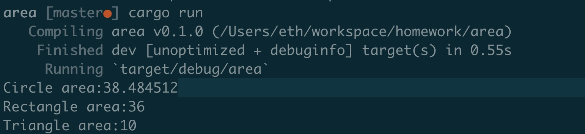

### Compute area


### Code 

```
use core::f32::consts::PI;

fn main() {
    let c = Circle{radius: 3.5};
    let r = Rectangle{width: 6.0, height: 6.0};
    let t = Triangle{base: 5.0, height:4.0};

    println!("Circle area:{}", area(&c));
    println!("Rectangle area:{}", area(&r));
    println!("Triangle area:{}", area(&t));
}

trait ComputeArea {
    fn get_area(&self) -> f32;
}

#[derive(Debug)]
struct Rectangle{
    width: f32,
    height: f32,
}

impl ComputeArea for Rectangle {
    fn get_area(&self) -> f32 {
        self.width * self.height
    }
}

#[derive(Debug)]
struct Circle {
    radius: f32
}

impl ComputeArea for Circle {
    fn get_area(&self) -> f32 {
        PI * self.radius.powf(2.0)
    }
}

#[derive(Debug)]
struct Triangle {
    base: f32,
    height: f32
}

impl ComputeArea for Triangle {
    fn get_area(&self) -> f32 {
        self.base * self.height / 2.0
    }
}


fn area<T: ComputeArea>(shape: &T) -> f32 {
    shape.get_area()
}
```